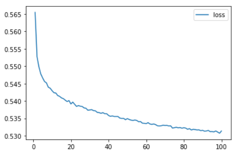
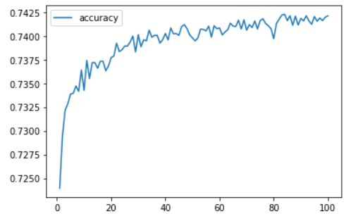

# Neural_Network_Charity_Analysis

## Overview

The goal of this project is to help Beks create a binary classifier that can predict whether applicants will be successful if funded by Alphabet Soup.

## Results
- Data Preprocessing
    - What variable(s) are considered the target(s) for your model?
      The column named as "IS_SUCCESSFUL" in the csv file is considered the target(s) for your model.
    - What variable(s) are considered to be the features for your model?    
      All columns other than "IS_SUCCESSFUL", "EIN", and "NAME" in the csv file are considered the features for your model.
    - What variable(s) are neither targets nor features, and should be removed from the input data?
      "EIN", and "NAME" are not considered as useful and thus should be removed.
- Compiling, Training, and Evaluating the Model
    - How many neurons, layers, and activation functions did you select for your neural network model, and why?
      I used three layers for the nn model. The first layer uses softsign activation funciton and has 60 neurons. The first layer uses softsign activation funciton and has 30 neurons. The third layer uses relu activation funciton and has 20 neurons. I increased the depth of the model to increase the accuracy. Different numbers of neurons and activation functions have been tested, but none was able boost the accuracy to more than 75%.
    - Were you able to achieve the target model performance?
      No.
    - What steps did you take to try and increase model performance?
      I adjusted the numebr of bins for the CLASSIFICATION value. I added one more layer in the model and adjuted the number of neurons. I tested with different activation functions. I also tested the number of epochs. As shown in the images below, the accuracy approaches to 75% as the number of epochs increases.

## Summary
The deep learning model used in this project was not able to achieve the target (75%). The data should be reviewed more carefully to understand what we should include in the model and what feature engineering needs to be done to achieve better accuracy.
